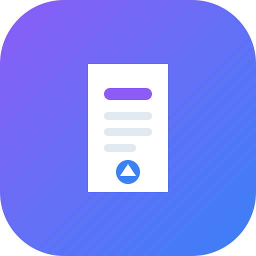
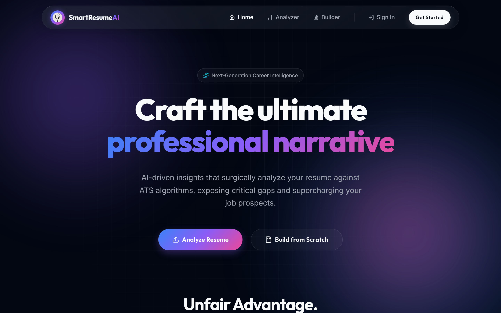
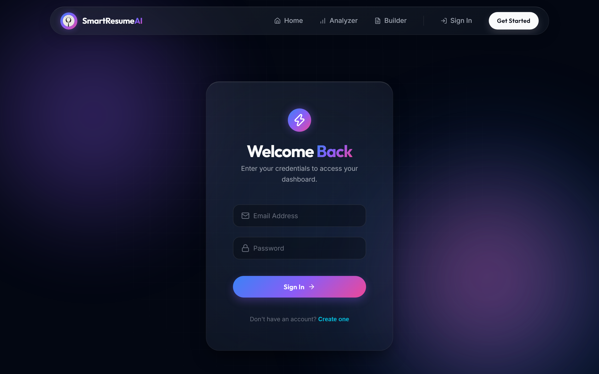
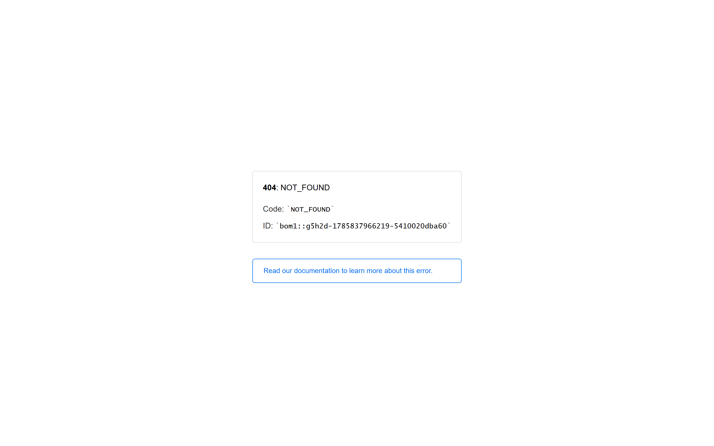
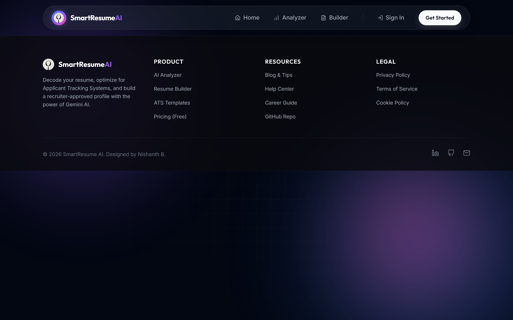
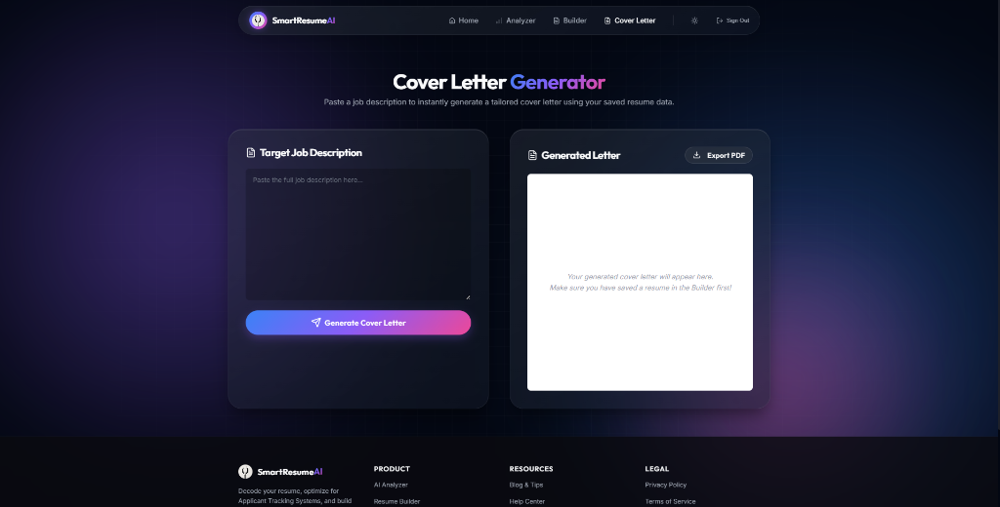

<div align="center">



# 📄 Smart AI Resume Analyzer & Builder

*Empowering professionals with AI-driven resume insights and a beautiful, live-synced builder.*

<p align="center">
  <a href="https://resume-ai-azure-two.vercel.app/">
    
  </a>
  <a href="https://github.com/Nishanth2434/Resume-AI/stargazers">
    
  </a>
  
  
</p>

<p align="center">
  
  
  
  
  
  
</p>

</div>

<br/>

<div align="center">

<a href="https://resume-ai-azure-two.vercel.app/">
  
</a>

<br/><br/>

| Route | Path | Description |
| :--- | :--- | :--- |
| **Home** | `/` | Landing page and overview |
| **Login / Sign Up** | `/login` | Secure Supabase authentication |
| **Analyzer** | `/analyze` | Upload and analyze resumes (ATS score & feedback) |
| **Builder** | `/build` | Live resume builder with themes & Magic Rewrite |
| **Cover Letter** | `/cover-letter` | AI-generated cover letter from saved resume |

</div>

---

## 📸 A Look Inside

<div align="center">
<b>Welcome to SmartResumeAI</b><br/>

</div>

<br/>

| 🔐 Login & Auth | 📝 Resume Analyzer |
| :---: | :---: |
|  |  |
| **🛠️ Resume Builder** | **✉️ AI Cover Letter** |
|  |  |

---

## ✨ Features

| Feature | Description |
| :--- | :--- |
| 🧠 **AI Resume Analysis** | Securely parse PDF/DOCX resumes and get real-time ATS scoring, actionable feedback, and keyword optimization via Google Gemini 1.5 Flash. |
| 🛠️ **Premium Resume Builder** | A two-column live-syncing builder with multiple high-contrast templates (Modern, Classic, Creative). |
| 🪄 **Magic Rewrite** | Click a single button on any bullet point to have Gemini automatically rewrite it into a highly professional, ATS-friendly format. |
| ✉️ **Cover Letter Generator** | Paste a job description and automatically generate a personalized cover letter using your securely saved resume data. |
| 🔐 **Supabase Authentication** | Enterprise-grade JWT-based login and signup keeping user resume data fully isolated and private via Row Level Security. |
| 📄 **One-Click PDF Export** | Render complex HTML styling perfectly into high-resolution PDFs using local browser processing (`html2pdf.js`). |

---

## 🛠 Tech Stack

| Layer | Technology |
| :--- | :--- |
| **Frontend Framework** | React 19.2 (Vite 8.2) |
| **Routing** | React Router DOM 7.18 |
| **Backend API** | Python 3 + FastAPI |
| **AI Engine** | Google Gemini (google-generativeai) |
| **Document Parsing** | PyMuPDF (fitz), Python-Docx |
| **Database & Auth** | Supabase (PostgreSQL, supabase-js 2.112) |
| **PDF Rendering** | html2pdf.js 0.14 |

---

## 🏗 Architecture Diagram

```mermaid
flowchart TD
    subgraph Frontend [React / Vite Client]
        UI[Browser UI]
        State[React Context / LocalStorage]
        UI <--> State
    end

    subgraph Backend [FastAPI Server]
        API_Analyze[/api/analyze]
        API_Rewrite[/api/rewrite]
        API_Cover[/api/cover-letter]
        Parser[PyMuPDF / Docx Parser]
    end

    subgraph External [Cloud Services]
        SB[(Supabase DB & Auth)]
        Gemini[Google Gemini 1.5 Flash]
    end

    UI -->|JWT Auth, Data Save/Load| SB
    UI -->|Multipart Uploads, JSON Payloads| Backend
    API_Analyze & API_Rewrite & API_Cover --> Gemini
    API_Cover --> SB
    API_Analyze --> Parser
```

---

## 📁 Project Structure

```text
📦 smart-resume-analysis
 ┣ 📂 backend/
 ┃ ┣ 📂 services/
 ┃ ┃ ┣ 📜 analyzer.py         # Gemini AI prompting logic
 ┃ ┃ ┗ 📜 parser.py           # PDF/DOCX text extraction
 ┃ ┣ 📜 main.py                 # FastAPI application, CORS, and Routes
 ┃ ┣ 📜 requirements.txt        # Python dependencies
 ┃ ┗ 📜 .env                    # Backend secrets
 ┣ 📂 docs/
 ┃ ┣ 📂 screenshots/            # UI screenshots
 ┃ ┗ 📜 logo.svg
 ┣ 📂 src/
 ┃ ┣ 📂 lib/
 ┃ ┃ ┗ 📜 supabase.js           # Supabase client initialization
 ┃ ┣ 📂 pages/
 ┃ ┃ ┣ 📜 Analyzer.jsx          # File upload and ATS dashboard
 ┃ ┃ ┣ 📜 Builder.jsx           # Live resume template engine
 ┃ ┃ ┣ 📜 CoverLetter.jsx       # AI job description matching
 ┃ ┃ ┣ 📜 Home.jsx              # Landing page
 ┃ ┃ ┗ 📜 Login.jsx             # Auth screen
 ┃ ┣ 📂 utils/                  # Helper utilities
 ┃ ┣ 📜 App.jsx                 # Routing and Layout
 ┃ ┣ 📜 index.css               # Global glassmorphism and theme variables
 ┃ ┗ 📜 main.jsx                # React DOM entry
 ┣ 📜 package.json              # Frontend dependencies
 ┗ 📜 vite.config.js
```

---

## ⚙️ Installation & Setup

<details open>
<summary><b>1. Clone the Repository</b></summary>
<br>

```bash
git clone https://github.com/Nishanth2434/Resume-AI.git
cd Resume-AI
```
</details>

<details open>
<summary><b>2. Frontend Setup</b></summary>
<br>

```bash
# Install Node dependencies
npm install

# Start the Vite development server
npm run dev
```
</details>

<details open>
<summary><b>3. Backend Setup</b></summary>
<br>

```bash
cd backend
python -m venv venv

# Activate virtual environment
# Windows: .\venv\Scripts\activate
# Mac/Linux: source venv/bin/activate

pip install -r requirements.txt

# Start the FastAPI server
uvicorn main:app --reload --port 8000
```
*(Don't forget to create both `.env.local` and `backend/.env` files!)*
</details>

---

## 🔐 Environment Variables

### Frontend (`.env.local`)
| Variable | Type | Description |
| :--- | :--- | :--- |
| `VITE_SUPABASE_URL` | **Required** | Your Supabase Project URL |
| `VITE_SUPABASE_ANON_KEY` | **Required** | Your Supabase Anonymous Key |
| `VITE_API_URL` | Optional | Backend URL (Defaults to `http://localhost:8000`) |

### Backend (`backend/.env`)
| Variable | Type | Description |
| :--- | :--- | :--- |
| `GEMINI_API_KEY` | **Required** | Google Generative AI API Key |
| `SUPABASE_URL` | **Required** | Your Supabase Project URL |
| `SUPABASE_ANON_KEY` | **Required** | Your Supabase Anonymous Key |
| `ALLOWED_ORIGINS` | Optional | Comma-separated list for CORS (e.g. `http://localhost:5173`) |

---

## 🔌 API Endpoints

| Method | Path | Access | Description |
| :--- | :--- | :--- | :--- |
| `GET` | `/` | Public | Health check / API Root |
| `POST` | `/api/analyze` | Public | Accepts a file upload (`resume_file`), parses it using PyMuPDF/Docx, and returns Gemini ATS feedback. |
| `POST` | `/api/rewrite` | Authenticated | Accepts a bullet point and returns an ATS-optimized rewrite using Gemini. |
| `POST` | `/api/cover-letter` | Authenticated | Fetches user's saved resume from Supabase, cross-references with a provided job description, and returns a tailored cover letter via Gemini. |
| `POST` | `/api/parse-to-builder` | Public | Parses an uploaded document directly into a structured JSON payload for the Builder. |

---

## 🛡️ Security

| Mechanism | Implementation |
| :--- | :--- |
| **Authentication** | Protected React Router wrapper (`<ProtectedRoute>`) ensuring only users with valid JWTs from Supabase can access the Builder or Cover Letter generator. |
| **Database Isolation** | Row Level Security (RLS) on Supabase prevents users from accessing or modifying `resumeData` belonging to another `user_id`. |
| **API Protection** | FastAPI endpoints require `Authorization: Bearer <token>` and validate the token directly with Supabase Admin SDK before executing operations. |
| **CORS Filtering** | Backend restricts origin domains to trusted frontend URLs via FastAPI's `CORSMiddleware`. |

---

## 🚀 Future Improvements

- [ ] **Templates Gallery:** Add a dozen more customizable PDF layouts.
- [ ] **LinkedIn Import:** Allow users to directly import their profile JSON into the Builder.
- [ ] **Grammar Engine:** Integrate a lightweight local NLP library to flag typos in the Builder before using the heavy Gemini API.

---

## 🤝 Contributing

<details open>
<summary><b>Contribution Guidelines</b></summary>
<br>

1. Fork the project.
2. Create your feature branch (`git checkout -b feature/AmazingFeature`).
3. Commit your changes using Conventional Commits (`git commit -m 'feat: Add some AmazingFeature'`).
4. Push to the branch (`git push origin feature/AmazingFeature`).
5. Open a Pull Request.
</details>

---

<div align="center">

### Author

**Nishanth B** - Full-Stack Developer


<a href="https://www.linkedin.com/in/nishanth-b-24b2006abc"></a>
<a href="https://github.com/Nishanth2434"></a>
<a href="mailto:nishanthbnishu24@gmail.com"></a>

<br/><br/>

Made with ❤️ by **NISHANTH B**

[Live Website](https://resume-ai-azure-two.vercel.app/) • [Features](#-features) • [Installation](#️-installation--setup) • [Contributing](#-contributing)

</div>
