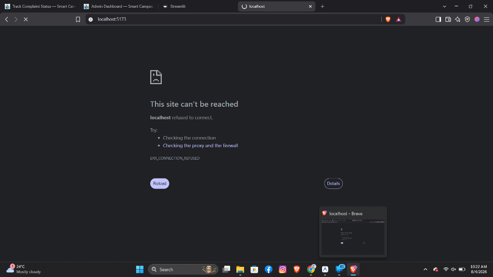
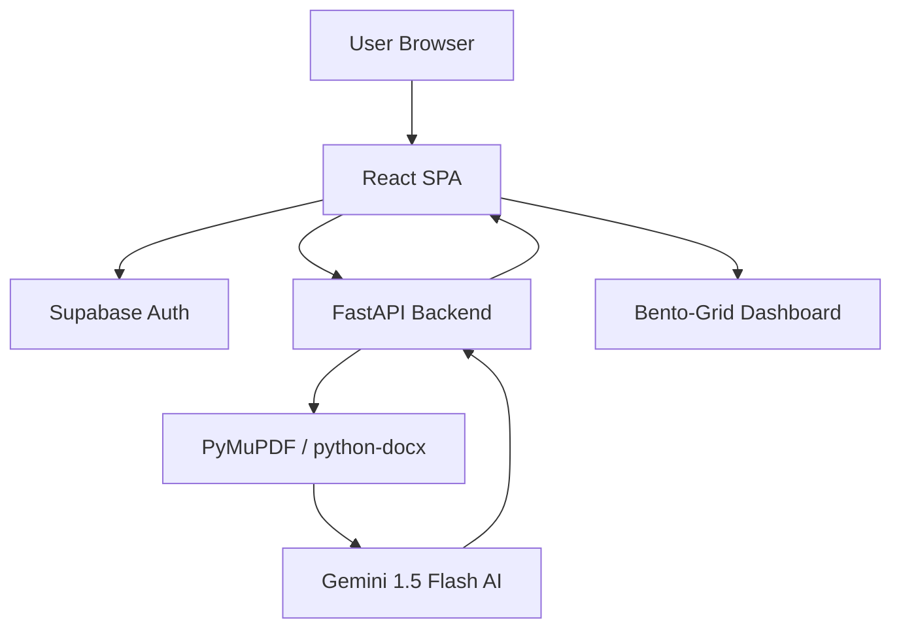

<div align="center">


# 🚀 Smart AI Resume Analyzer & Builder

### An ultra-premium, AI-powered web application — analyze, build, and optimize your ATS-friendly resume in one place.

<br/>

[](https://github.com/Nishanth2434/Resume-AI/stargazers)
[](LICENSE)
[](https://github.com/Nishanth2434/Resume-AI/releases)

[](https://react.dev)
[](https://python.org)
[](https://fastapi.tiangolo.com)
[](https://tailwindcss.com)
[](https://supabase.com)
[](https://ai.google.dev/)

</div>

---

## 📸 A Look Inside — Website Trailer

<div align="center">

<b>🏠 Home — Premium glassmorphism landing page</b>


</div>

<table>
  <tr>
    <td width="50%"><b>🧠 AI Diagnostic Report</b><br/></td>
    <td width="50%"><b>📝 Resume Builder</b><br/></td>
  </tr>
</table>

<div align="center">

🔒 The resume analysis, builder tools, and saving features live behind secure authentication — powered by Supabase.

</div>

---

## ✨ Features

<table>
  <tr>
    <td width="33%">
      <h3>🧠 AI Diagnostics</h3>
      Upload a PDF/DOCX and let Gemini 1.5 Flash AI grade ATS compatibility, keywords, and action velocity.
    </td>
    <td width="33%">
      <h3>📝 Interactive Builder</h3>
      Dynamic, real-time resume building with custom sections, photo uploads, and live previews.
    </td>
    <td width="33%">
      <h3>🔐 Secure Authentication</h3>
      Protected routing and user sessions managed entirely via Supabase Auth (Sign Up / Sign In).
    </td>
  </tr>
  <tr>
    <td>
      <h3>⚡ Glassmorphism UI</h3>
      Ultra-premium aesthetic featuring bento-grids, gradients, mesh backgrounds, and smooth CSS animations.
    </td>
    <td>
      <h3>📊 Actionable Directives</h3>
      The AI generates exactly what you need to fix to hit a 100% ATS score, parsed directly into the UI.
    </td>
    <td>
      <h3>📱 Responsive Design</h3>
      Mobile-first layouts ensuring the dashboard and builder scale perfectly down to phone screens.
    </td>
  </tr>
</table>

---

## 🧰 Tech Stack

| Layer               | Technology                                                |
| :------------------ | :-------------------------------------------------------- |
| **Frontend**        | React (Vite) + React Router                               |
| **Backend**         | Python 3 + FastAPI + Uvicorn                              |
| **Authentication**  | Supabase Auth (JWT sessions)                              |
| **Document Parsing**| PyMuPDF (`pymupdf`) & Python-Docx (`python-docx`)         |
| **AI Integration**  | Google Generative AI (`gemini-1.5-flash`)                 |
| **Styling**         | Raw CSS (Glassmorphism, Animations) + Tailwind concepts   |
| **Icons**           | Lucide React                                              |

---

## 🏗️ Architecture

The app uses a decoupled architecture. The React frontend handles the premium UI and auth state, while the Python FastAPI backend securely parses documents and interfaces with Google's Gemini AI.

```text
Frontend (React + Vite)
        ↓
Supabase Auth (JWT session + route protection)
        ↓
Backend (FastAPI on Port 8000)
        ↓
Document Parsing (PyMuPDF extracts raw text from PDF)
        ↓
AI Processing (Gemini 1.5 Flash analyzes text)
        ↓
Frontend (Renders JSON into Bento-Grid Dashboard)
```



---

## 📁 Project Structure

```text
Resume-AI/
├── assets/                     # README images and screenshots
├── backend/
│   ├── services/
│   │   ├── analyzer.py         # Gemini AI integration and prompting
│   │   └── parser.py           # PyMuPDF and python-docx extraction
│   ├── venv/                   # Python virtual environment
│   ├── .env                    # Gemini API Key (ignored in git)
│   └── main.py                 # FastAPI server and endpoints
├── src/
│   ├── components/             # Reusable UI components
│   ├── lib/                    # Supabase client setup
│   ├── pages/                  # Route components
│   │   ├── Home.jsx            # Landing page
│   │   ├── Login.jsx           # Supabase Auth portal
│   │   ├── Analyzer.jsx        # AI Diagnostic dashboard
│   │   └── Builder.jsx         # Interactive resume builder
│   ├── App.jsx                 # Routing and AuthContext provider
│   ├── index.css               # Global glassmorphism tokens & animations
│   └── main.jsx
├── .env.local                  # Supabase URLs & Keys (ignored in git)
├── package.json
└── vite.config.js
```

---

## ⚙️ Installation

<details open>
<summary><b>1 · Clone the repository</b></summary>

```bash
git clone https://github.com/Nishanth2434/Resume-AI.git
cd Resume-AI
```

</details>

<details open>
<summary><b>2 · Frontend Setup</b></summary>

Install the Node dependencies:
```bash
npm install
```

Create a `.env.local` file in the root directory and add your Supabase credentials:
```env
VITE_SUPABASE_URL=https://your-project.supabase.co
VITE_SUPABASE_ANON_KEY=your_supabase_anon_key
```

</details>

<details open>
<summary><b>3 · Backend Setup</b></summary>

Navigate to the backend directory and set up a virtual environment:
```bash
cd backend
python -m venv venv
```

Activate the virtual environment:
- **Windows**: `.\venv\Scripts\activate`
- **Mac/Linux**: `source venv/bin/activate`

Install the Python dependencies:
```bash
pip install fastapi uvicorn python-multipart pymupdf python-docx python-dotenv google-genai google-generativeai
```

Create a `.env` file in the `backend/` directory and add your Gemini API Key:
```env
GEMINI_API_KEY=your_gemini_api_key_here
```

</details>

<details open>
<summary><b>4 · Run the app</b></summary>

Open two separate terminal windows.

**Terminal 1 (Frontend):**
```bash
npm run dev
```

**Terminal 2 (Backend):**
```bash
cd backend
.\venv\Scripts\activate
uvicorn main:app --reload --port 8000
```

Visit `http://localhost:5173` in your browser to experience the application!

</details>

---

## 🔌 API Endpoints

|  Method  | Endpoint                       | Description                                                             |
| :------: | :----------------------------- | :---------------------------------------------------------------------- |
|  `POST`  | `/api/analyze`                 | Uploads a PDF/DOCX, extracts text, and returns Gemini AI ATS analysis JSON |

---

## 🧪 Technologies Used — and why

| Technology                        | Why it was chosen                                                                            |
| :-------------------------------- | :------------------------------------------------------------------------------------------- |
| **React**                         | Mature component model and fast state management for the interactive Builder.                |
| **FastAPI**                       | Lightning-fast Python backend, perfect for handling file uploads and AI processing.          |
| **Gemini 1.5 Flash AI**           | Fast, highly capable LLM from Google, perfect for parsing and formatting resume directives.  |
| **Supabase Auth**                 | Secure, out-of-the-box JWT authentication without the hassle of custom user tables.          |
| **PyMuPDF**                       | Industry-standard, highly reliable text extraction from PDF documents.                       |
| **Raw CSS + Animations**          | Complete control over the glassmorphism aesthetic, gradients, and stagger animations.        |
| **Lucide Icons**                  | Consistent, lightweight, tree-shakeable icon set.                                            |

---

## 👨‍💻 Author

<table>
  <tr>
    <td align="center" width="180">
      <br/>
      <b>NISHANTH B</b><br/>
      <sub>Aspiring Software & Web Developer</sub>
    </td>
    <td>
      <p>Motivated Computer Science Engineering student. Built the Smart AI Resume Analyzer end-to-end — from the glassmorphism UI to the Gemini AI backend integration.</p>
      <a href="https://linkedin.com/in/nishanth-b-24b2006a"></a>
      <a href="https://github.com/Nishanth2434"></a>
      <a href="mailto:nishanthbnishu24@gmail.com"></a>
    </td>
  </tr>
</table>

---

<div align="center">

Made with ❤️ by **NISHANTH B**

<a href="#-features"><b>Features</b></a> ·
<a href="#%E2%9A%99%EF%B8%8F-installation"><b>Install</b></a>

<sub>Smart AI Resume Analyzer & Builder — decode it, build it, optimize it.</sub>

</div>
